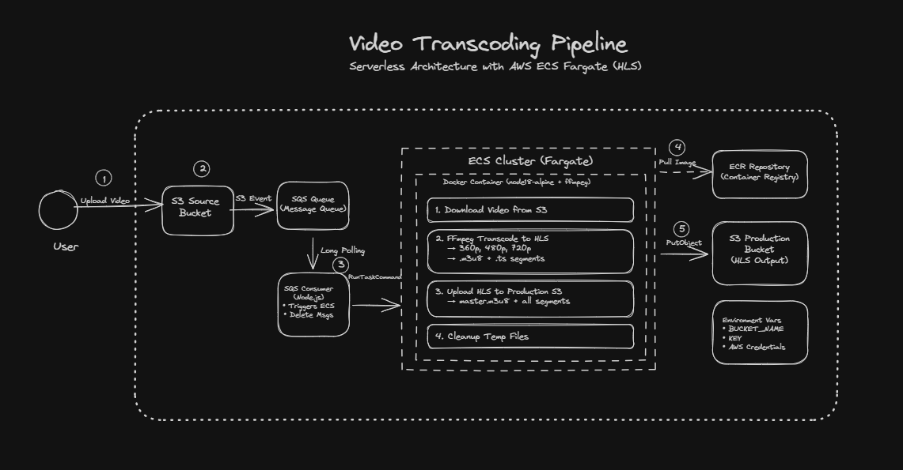

# Video Transcoding Pipeline

A serverless video transcoding pipeline using AWS services. This system automatically processes videos uploaded to S3, transcodes them into **HLS (HTTP Live Streaming)** format with multiple resolutions using FFmpeg, and stores the output in a production S3 bucket for adaptive bitrate streaming.

## System Design



### Architecture Flow

1. **User Upload** → Video uploaded to S3 Source Bucket
2. **S3 Event** → S3 triggers event notification to SQS Queue
3. **SQS Consumer** → Node.js service polls queue (long-polling)
4. **ECS Fargate** → Container spins up via RunTaskCommand
5. **FFmpeg Transcode** → Video transcoded to HLS format (360p, 480p, 720p)
6. **HLS Output** → Creates `.m3u8` playlists and `.ts` segments for each resolution
7. **Master Playlist** → Generates `master.m3u8` for adaptive bitrate streaming
8. **Production Upload** → All HLS files uploaded to production S3
9. **Cleanup** → Temporary files cleaned up automatically

## HLS Output Structure

```
production-bucket/
└── {videoId}/
    ├── master.m3u8              # Master playlist (load this to play)
    ├── 360p/
    │   ├── playlist.m3u8        # 360p quality playlist
    │   ├── segment_000.ts       # Video segments
    │   ├── segment_001.ts
    │   └── ...
    ├── 480p/
    │   ├── playlist.m3u8
    │   └── segment_xxx.ts
    └── 720p/
        ├── playlist.m3u8
        └── segment_xxx.ts
```

**To play the video:** `https://your-bucket.s3.amazonaws.com/{videoId}/master.m3u8`

## Prerequisites

- Node.js 18+
- Docker
- AWS CLI configured
- AWS Account with the following services:
  - S3 (source and destination buckets)
  - SQS Queue
  - ECS Cluster (Fargate)
  - ECR Repository

## Project Structure

```
videoPipeliine/
├── src/
│   └── index.ts          # SQS consumer that triggers ECS tasks
├── container/
│   ├── index.js          # HLS transcoding logic (runs in Docker)
│   ├── Dockerfile        # Docker image definition
│   └── package.json      # Container dependencies
├── .env                  # Environment variables (do not commit)
├── .env.example          # Environment variables template
├── package.json
└── tsconfig.json
```

## Environment Variables

Copy `.env.example` to `.env` and fill in your values:

```
AWS_ACCESS_KEY_ID=your_access_key_id
AWS_SECRET_ACCESS_KEY=your_secret_access_key
AWS_REGION=us-east-1
SQS_QUEUE_URL=https://sqs.us-east-1.amazonaws.com/your_account_id/your_queue_name
ECS_TASK_DEFINITION=arn:aws:ecs:us-east-1:your_account_id:task-definition/your_task_name
ECS_CLUSTER=arn:aws:ecs:us-east-1:your_account_id:cluster/your_cluster_name
ECS_SECURITY_GROUP=sg-xxxxxxxxx
ECS_SUBNETS=subnet-xxx,subnet-xxx,subnet-xxx
```

## Setup

### 1. Install Dependencies

```bash
npm install
```

### 2. Build and Push Docker Image

#### Linux / macOS (Bash)

```bash
# Set AWS credentials
export AWS_ACCESS_KEY_ID="your_access_key"
export AWS_SECRET_ACCESS_KEY="your_secret_key"
export AWS_DEFAULT_REGION="us-east-1"

# Login to ECR
aws ecr get-login-password --region us-east-1 | docker login --username AWS --password-stdin <account_id>.dkr.ecr.us-east-1.amazonaws.com

# Build and push
cd container
docker build -t video-transcoder .
docker tag video-transcoder:latest <account_id>.dkr.ecr.us-east-1.amazonaws.com/video-transcoder:latest
docker push <account_id>.dkr.ecr.us-east-1.amazonaws.com/video-transcoder:latest
```

#### Windows (PowerShell)

```powershell
# Set AWS credentials
$env:AWS_ACCESS_KEY_ID = "your_access_key"
$env:AWS_SECRET_ACCESS_KEY = "your_secret_key"
$env:AWS_DEFAULT_REGION = "us-east-1"

# Login to ECR
aws ecr get-login-password --region us-east-1 | docker login --username AWS --password-stdin <account_id>.dkr.ecr.us-east-1.amazonaws.com

# Build and push
cd container
docker build -t video-transcoder .
docker tag video-transcoder:latest <account_id>.dkr.ecr.us-east-1.amazonaws.com/video-transcoder:latest
docker push <account_id>.dkr.ecr.us-east-1.amazonaws.com/video-transcoder:latest
```

### 3. Run the SQS Consumer

```bash
npm run dev
```

## Output Resolutions

The pipeline transcodes videos to HLS format with the following resolutions:

| Resolution | Width | Height | Segment Duration |
| ---------- | ----- | ------ | ---------------- |
| 360p       | 640   | 360    | 10 seconds       |
| 480p       | 854   | 480    | 10 seconds       |
| 720p       | 1280  | 720    | 10 seconds       |

## AWS ECS Task Configuration

- Launch Type: Fargate
- Operating System: Linux/X86_64
- Network Mode: awsvpc

## Features

- ✅ **HLS (HTTP Live Streaming)** output with `.m3u8` playlists and `.ts` segments
- ✅ **Adaptive Bitrate Streaming** via master playlist
- ✅ Parallel transcoding to multiple resolutions
- ✅ Automatic cleanup of temporary files after processing
- ✅ Long polling for efficient SQS message consumption
- ✅ Environment-based configuration (no hardcoded secrets)

## Roadmap

- [ ] Thumbnail generation
- [ ] Progress notifications via SNS/WebSocket
- [ ] DRM support
- [ ] Custom bitrate configurations

## License

MIT
